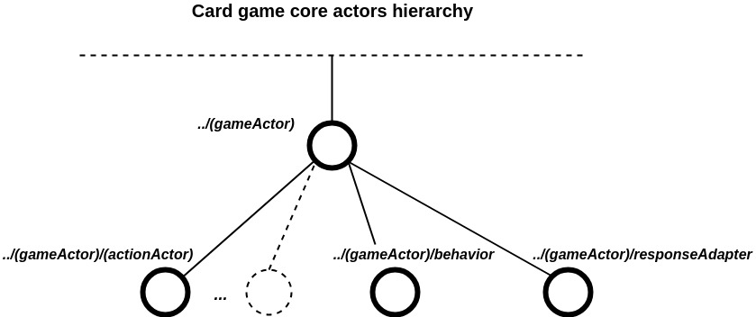
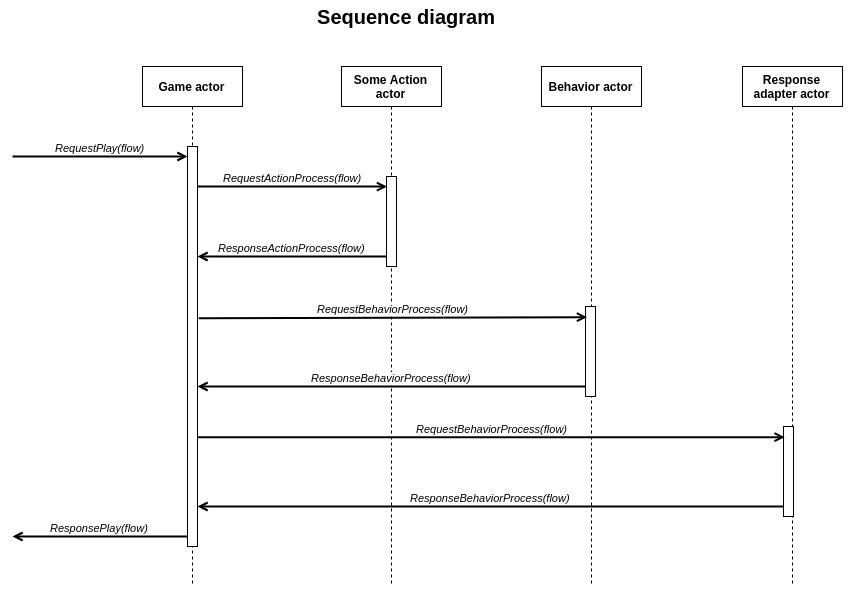

## Card game core based on Scala Akka actors

This core is intended for the implementation of well-known card games (i.e. blackjack, baccarat, three-card brag) based on a pseudo random number generator.
<br />
<br />

### Prerequisites
* JDK 1.8
* Scala 2.12.8
* sbt 1.2.8

### Tests

```
sbt test
```

##



<br />
<br />

##


